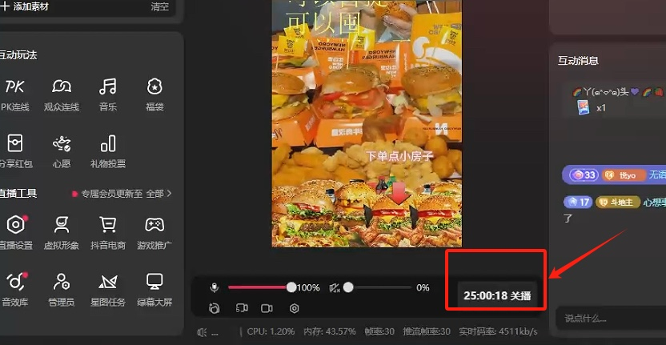

# MengYun AI

MengYun AI 是一个由

`ChatGPT / ChatGLM / TTS / SVC / 摄像头驱动 / 声卡驱动 `

集成一体的虚拟 AI 主播

专注`抖音`市场的直播带货，同时也支持 `快手 / B站 / YouTube / 斗鱼` 等平台。

<a href="https://www.chat-chat.top/meng-yun/">📄 官网</a>
 | 
<a href="https://space.bilibili.com/86928061" target="_blank">▶︎ 视频教程合集</a>
 | 
<a href="//github.com/meng-yun-ai/meng-yun-ai" target="_blank">🍉 GitHub</a>

## <a href="https://www.chat-chat.top/meng-yun/">下载地址</a>

请使用 chrome 浏览器打开

## 直播效果

众所周知，抖音的平台规则是最严格的，含金量不用多说

## ⭐️Star 经历

